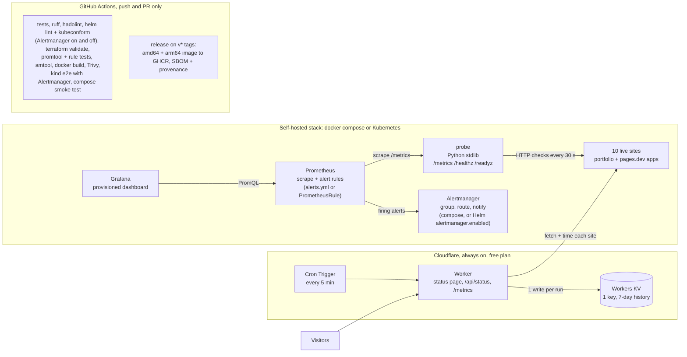
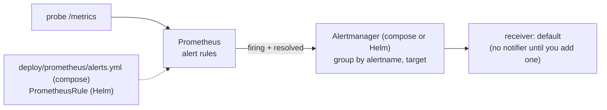

# FleetWatch

[](https://github.com/naniiic137/fleetwatch/actions/workflows/ci.yml)
[](https://github.com/naniiic137/fleetwatch/actions/workflows/release.yml)
[](https://fleetwatch.hamza-benismail-6.workers.dev)

**Live status page: [fleetwatch.hamza-benismail-6.workers.dev](https://fleetwatch.hamza-benismail-6.workers.dev)**

**Uptime, latency and TLS-expiry monitoring for my live sites, built end to end:**
a dependency-free Python probe with hand-written Prometheus metrics, a Docker
Compose stack with Prometheus alerts, Alertmanager and a Grafana dashboard, a hardened Helm
chart (with an optional Alertmanager and the same alert rules as a PrometheusRule), a
Terraform module, a CI pipeline that spins up a real Kubernetes cluster, and an always-on
Cloudflare Worker that serves the public status page.

## Architecture



## What each part shows

| Part | Where | What it demonstrates |
| --- | --- | --- |
| **Probe** | [`probe/`](probe) | Python 3.11+ **stdlib only**: HTTP(S) checks with status, latency, TLS days-to-expiry (via `ssl`) and keyword checks; a hand-written Prometheus exposition (HELP/TYPE, histogram buckets, gauges, counters); `/healthz`, `/readyz` (ready after the first round); JSON status on `/`; env-var config; structured JSON logs; graceful SIGTERM shutdown. 46 unit tests against local fake HTTP/HTTPS servers, no real network. |
| **Container** | [`Dockerfile`](Dockerfile) | Multi-stage build (unit tests run in the build stage), `python:3.12-slim`, numeric non-root user `10001`, `HEALTHCHECK` without curl. |
| **Local stack** | [`docker-compose.yml`](docker-compose.yml), [`deploy/prometheus`](deploy/prometheus), [`deploy/alertmanager`](deploy/alertmanager), [`deploy/grafana`](deploy/grafana) | Probe + Prometheus (scrape config + alert rules with `promtool` unit tests) + Alertmanager (grouping, one route, a receiver ready for email/Slack/Telegram) + Grafana (provisioned datasource + dashboard: uptime %, latency p50/p95, cert days left, up/down timeline). |
| **Kubernetes** | [`deploy/helm/fleetwatch`](deploy/helm/fleetwatch) | Deployment, Service, ConfigMap of targets, liveness/readiness probes, `runAsNonRoot` + `readOnlyRootFilesystem` + drop ALL capabilities + seccomp, resources, NetworkPolicy (ingress 8080, egress DNS + 80/443 only), optional ServiceMonitor and PrometheusRule (the same 3 alerts), optional Alertmanager (same config as compose, same hardening, its own NetworkPolicy, notifier credentials from an existing Secret), `values.schema.json` that rejects insecure overrides. |
| **IaC** | [`deploy/terraform`](deploy/terraform) | Terraform module deploying the chart with the `helm` provider, typed + validated variables and useful outputs. |
| **CI/CD** | [`.github/workflows`](.github/workflows) | Lint, test, build, scan, a real **kind** cluster e2e and a Compose smoke test on every push/PR; tagged releases push a multi-arch image with SBOM and provenance to GHCR. |
| **Edge status page** | [`worker/`](worker) | Cloudflare Worker in plain JS (no npm deps): Cron Trigger every 5 min, rolling 7-day history in **one** KV key, public status page (24 h / 7 d uptime, inline-SVG latency sparkline, dark/light, phone friendly), `/api/status` and `/metrics`. Pure functions tested with `node --test`. |

## Run it

### Probe on its own (Python 3.11+, nothing to install)

```bash
cd probe
FW_TARGETS_FILE=../targets.yaml FW_PORT=8080 python -m fleetwatch_probe
curl localhost:8080/metrics
python -m unittest discover -s tests -t .     # the test suite
```

### Docker Compose: probe + Prometheus + Alertmanager + Grafana

```bash
docker compose up -d --build
```

| URL | What |
| --- | --- |
| http://localhost:8080/ | probe JSON status (`/metrics`, `/healthz`, `/readyz`) |
| http://localhost:9090/alerts | Prometheus with the FleetWatch alert rules |
| http://localhost:9093/ | Alertmanager (grouped alerts, silences) |
| http://localhost:3000/ | Grafana "FleetWatch" dashboard (anonymous read-only) |

Edit [`targets.yaml`](targets.yaml) to change the sites, then `docker compose restart probe`.

### Kubernetes with kind + Helm

```bash
kind create cluster --name fleetwatch
docker build -t fleetwatch-probe:dev .
kind load docker-image fleetwatch-probe:dev --name fleetwatch
helm install fleetwatch deploy/helm/fleetwatch \
  --namespace fleetwatch --create-namespace \
  --set image.repository=fleetwatch-probe --set image.tag=dev --set image.pullPolicy=Never \
  --wait
kubectl -n fleetwatch port-forward svc/fleetwatch 8080:8080
curl localhost:8080/metrics
```

With a released image, skip the build/load steps and drop the `--set image.*` flags
(the chart defaults to `ghcr.io/naniiic137/fleetwatch:<appVersion>`).
Set `serviceMonitor.enabled=true` and `prometheusRule.enabled=true` if the cluster runs the
Prometheus Operator.

Add `--set alertmanager.enabled=true` to run Alertmanager next to the probe, with the same
config as the compose stack:

```bash
kubectl -n fleetwatch port-forward svc/fleetwatch-alertmanager 9093:9093
curl localhost:9093/-/ready
```

**Why Alertmanager is off by default.** A cluster with the Prometheus Operator usually runs
its own Alertmanager already, so the chart's default install stays the probe alone (and an
upgrade of an existing release adds nothing). The compose stack is where everything is on
out of the box. CI covers both states: `helm lint` and kubeconform render the chart with
Alertmanager off and on, and the kind e2e installs it with `alertmanager.enabled=true`, so
the probe checks still run on every push and the Alertmanager pod also has to come up Ready
and answer `/-/ready`.

#### Chart values

| Value | Default | Meaning |
| --- | --- | --- |
| `image.repository` / `image.tag` / `image.pullPolicy` | `ghcr.io/naniiic137/fleetwatch` / appVersion / `IfNotPresent` | probe image |
| `replicaCount` | `1` | probe replicas |
| `config.intervalSeconds`, `timeoutSeconds`, `concurrency`, `logLevel` | `30`, `10`, `8`, `INFO` | probe settings (`FW_*` env vars) |
| `targets` | the 10 sites of `targets.yaml` | rendered into the targets ConfigMap |
| `service.type` / `service.port` | `ClusterIP` / `8080` | probe Service |
| `podSecurityContext`, `securityContext` | non-root `10001`, read-only root FS, drop ALL, seccomp | the schema rejects weaker values |
| `resources`, `livenessProbe`, `readinessProbe` | small requests/limits, `/healthz`, `/readyz` | probe container |
| `networkPolicy.enabled` / `ingressFrom` / `egressPorts` | `true` / `[]` (any pod) / `[80, 443]` | probe NetworkPolicy (egress also allows DNS) |
| `serviceMonitor.enabled` / `interval` / `scrapeTimeout` / `labels` | `false` / `30s` / `10s` / `{}` | ServiceMonitor for the Prometheus Operator |
| `prometheusRule.enabled` / `labels` | `false` / `{}` | PrometheusRule with the 3 alerts of `deploy/prometheus/alerts.yml` (add the labels your `ruleSelector` matches) |
| `alertmanager.enabled` | `false` | deploy Alertmanager (Deployment, Service, ConfigMap, NetworkPolicy) |
| `alertmanager.image.repository` / `tag` / `pullPolicy` | `prom/alertmanager` / `v0.28.1` / `IfNotPresent` | same image as compose |
| `alertmanager.config` | `""` | full `alertmanager.yml` as a string; empty uses the compose config (receiver `default`, no notifier) |
| `alertmanager.existingSecret` | `""` | Secret with notifier credentials, mounted read-only at `/etc/alertmanager/secrets` |
| `alertmanager.service.type` / `port` | `ClusterIP` / `9093` | Alertmanager Service |
| `alertmanager.podSecurityContext`, `alertmanager.securityContext` | non-root `65534` (nobody), read-only root FS (data in an `emptyDir`), drop ALL, seccomp | the schema rejects weaker values |
| `alertmanager.resources`, `livenessProbe`, `readinessProbe` | 10m/32Mi requests, 100m/128Mi limits, `/-/healthy`, `/-/ready` | Alertmanager container |
| `alertmanager.networkPolicy.enabled` / `ingressFrom` / `egressPorts` | `true` / `[]` (any pod) / `[443, 587]` | ingress on 9093 only; egress DNS plus HTTPS webhooks and SMTP submission |
| `nodeSelector`, `tolerations`, `affinity` | empty | probe scheduling |

### Terraform

```bash
cd deploy/terraform
terraform init
terraform apply -var kube_context=kind-fleetwatch \
  -var image_repository=fleetwatch-probe -var image_tag=dev -var image_pull_policy=Never
```

The chart's Alertmanager and PrometheusRule are variables too: `alertmanager_enabled`,
`alertmanager_existing_secret`, `alertmanager_config` (for example
`-var "alertmanager_config=$(cat my-alertmanager.yml)"`) and `prometheus_rule_enabled`;
`network_policy_enabled` covers both NetworkPolicies.

Outputs: release name, namespace, status, chart version, service name, the
in-cluster metrics URL and a ready-to-paste `kubectl port-forward` command.

### Cloudflare Worker

Deployed from this repo by Cloudflare's Git integration: see
[`docs/DEPLOY-CLOUDFLARE.md`](docs/DEPLOY-CLOUDFLARE.md). Tests: `cd worker && node --test`.

## Probe reference

| Env var | Default | Meaning |
| --- | --- | --- |
| `FW_TARGETS_FILE` | `targets.yaml` (`/etc/fleetwatch/targets.yaml` in the image) | targets file |
| `FW_LISTEN_HOST` / `FW_PORT` | `0.0.0.0` / `8080` | HTTP listener |
| `FW_INTERVAL_SECONDS` | `30` | seconds between probe rounds |
| `FW_TIMEOUT_SECONDS` | `10` | per-check timeout |
| `FW_CONCURRENCY` | `8` | parallel checks |
| `FW_MAX_BODY_BYTES` | `1048576` | body bytes read for the keyword check |
| `FW_LOG_LEVEL` | `INFO` | `DEBUG`, `INFO`, `WARNING`, `ERROR` |

| Metric | Type | Labels |
| --- | --- | --- |
| `fleetwatch_probe_up` | gauge | `target`, `url` |
| `fleetwatch_probe_duration_seconds` | histogram (0.05 … 10 s) | `target` |
| `fleetwatch_probe_tls_cert_expiry_days` | gauge | `target` |
| `fleetwatch_probe_http_status_code` | gauge | `target` |
| `fleetwatch_probe_checks_total` | counter | `target`, `result` |
| `fleetwatch_probe_check_failures_total` | counter | `target`, `reason` (status, keyword, timeout, dns, connection, tls, protocol) |
| `fleetwatch_probe_last_check_timestamp_seconds` | gauge | `target` |
| `fleetwatch_probe_rounds_total`, `fleetwatch_probe_round_duration_seconds`, `fleetwatch_probe_targets`, `fleetwatch_probe_build_info` | counter / gauges | |

## Alerts



Rules are defined in [`deploy/prometheus/alerts.yml`](deploy/prometheus/alerts.yml), checked by
`promtool check rules` and unit-tested by `promtool test rules` in CI. The Helm chart ships
the same rules as a PrometheusRule (`prometheusRule.enabled=true`) from
[`files/alerts.yml`](deploy/helm/fleetwatch/files/alerts.yml); CI renders it and fails if it
differs from `deploy/prometheus/alerts.yml`, so the Kubernetes path gets the same alerts.

| Alert | Expression | For | Severity |
| --- | --- | --- | --- |
| `FleetWatchTargetDown` | `fleetwatch_probe_up == 0` | 2m | critical |
| `FleetWatchHighLatency` | `histogram_quantile(0.95, sum by (target, le) (rate(fleetwatch_probe_duration_seconds_bucket[5m]))) > 2` | 10m | warning |
| `FleetWatchCertExpiringSoon` | `fleetwatch_probe_tls_cert_expiry_days < 14` | 15m | warning |

### Alert-rule unit tests

[`deploy/prometheus/tests/`](deploy/prometheus/tests) feeds synthetic series to the
rules and asserts exactly which alerts fire, with which labels and annotations:

| Test file | Covers |
| --- | --- |
| `target_down_test.yml` | a site down from t=0 is still pending at 1m and 1m59s and fires at 2m (and 5m) for that site only; a healthy site never fires; a 1m45s outage that recovers never fires |
| `high_latency_test.yml` | a site whose checks all take 2.5 to 5 s (p95 = 4.875 s) is pending at 5m and 9m and fires by 12m, with the value in the annotation; a site under 1 s never fires |
| `cert_expiry_test.yml` | a cert with 10.5 days left is pending at 10m and 14m59s and fires at 15m; exactly 14 days and 60 days never fire |

```bash
promtool test rules deploy/prometheus/tests/*_test.yml
```

### Alertmanager

Prometheus sends alerts to Alertmanager (`alerting:` in
[`prometheus.yml`](deploy/prometheus/prometheus.yml)). The config in
[`deploy/alertmanager/alertmanager.yml`](deploy/alertmanager/alertmanager.yml) has one
route that groups by `alertname` and `target` (wait 30s, regroup every 5m, repeat every 4h)
into a receiver called `default`. That receiver has **no notifier**, so the repo holds no
secrets: alerts are visible at http://localhost:9093 and nothing is sent. CI runs
`amtool check-config` on it, and the compose smoke test checks that Alertmanager is ready
and that Prometheus lists it in `/api/v1/alertmanagers`.

#### Plug in email, Slack or Telegram

1. Put the secret in a file under `deploy/alertmanager/secrets/` (git-ignored; the folder
   is mounted read-only at `/etc/alertmanager/secrets`). Alertmanager runs as `nobody`,
   so the file must be world-readable (`chmod 644`).
2. Add the matching block under the `default` receiver (the commented examples in
   `alertmanager.yml` are ready to uncomment):

   | Channel | Block | Secret file |
   | --- | --- | --- |
   | Email | `email_configs` with `to`, `from`, `smarthost`, `auth_username` | `auth_password_file` |
   | Slack | `slack_configs` with `channel` | `api_url_file` (incoming webhook URL) |
   | Telegram | `telegram_configs` with `chat_id` | `bot_token_file` (token from @BotFather) |

3. Check and reload:
   ```bash
   docker compose exec alertmanager amtool check-config /etc/alertmanager/alertmanager.yml
   docker compose restart alertmanager
   ```

#### Alertmanager on Kubernetes

With `alertmanager.enabled=true` the chart runs Alertmanager v0.28.1 with the compose config
(from [`files/alertmanager.yml`](deploy/helm/fleetwatch/files/alertmanager.yml); CI fails if
it drifts from `deploy/alertmanager/alertmanager.yml`), as a non-root user with a read-only
root filesystem, its data in an `emptyDir`, all capabilities dropped, probes on `/-/healthy`
and `/-/ready`, and a NetworkPolicy that only opens port 9093 in and DNS + 443/587 out.
Clustering is off (`--cluster.listen-address=`), like in compose.

To get notified, the secret goes in a Kubernetes Secret instead of a file on disk:

```bash
kubectl -n fleetwatch create secret generic fleetwatch-notifiers \
  --from-file=slack_webhook_url=./slack_webhook_url
# my-alertmanager.yml: files/alertmanager.yml with the slack_configs block uncommented
helm upgrade --install fleetwatch deploy/helm/fleetwatch -n fleetwatch \
  --set alertmanager.enabled=true \
  --set alertmanager.existingSecret=fleetwatch-notifiers \
  --set-file alertmanager.config=my-alertmanager.yml
```

The Secret is mounted at `/etc/alertmanager/secrets`, the same path as in compose, so the
`*_file` settings do not change; `fsGroup` makes the files readable without a `chmod`.
To send alerts from an Operator-managed Prometheus, add the Service to its `Prometheus`
resource under `spec.alerting.alertmanagers` (`name: fleetwatch-alertmanager`,
`namespace: fleetwatch`, `port: http`).

## CI

| Job | Checks |
| --- | --- |
| Probe unit tests | `python -m unittest` (fake HTTP/HTTPS servers, SIGTERM shutdown test) |
| Lint Python | `ruff check` (installed in CI only) |
| Lint Dockerfile | hadolint |
| Helm | `helm lint --strict` and `helm template` piped into `kubeconform -strict` with Alertmanager off and on (incl. the ServiceMonitor and PrometheusRule CRD schemas); the rendered PrometheusRule and Alertmanager ConfigMap must equal `deploy/prometheus/alerts.yml` and `deploy/alertmanager/alertmanager.yml`, then pass `promtool check rules` and `amtool check-config`; the schema rejects insecure values for the probe and for Alertmanager |
| Terraform | `terraform fmt -check`, `terraform validate` |
| Prometheus + Alertmanager | `promtool check config`, `promtool check rules`, `promtool test rules` (alert-rule unit tests), `amtool check-config` |
| Worker | `node --test` |
| Docker | image build, non-root + healthcheck check, Trivy scan (report only, shown in the job summary) |
| E2E on kind | builds the image, loads it into a kind cluster, `helm install --wait` with `alertmanager.enabled=true` and a notifier Secret, port-forward, asserts `/healthz`, `/readyz` and the metric families on `/metrics`; then checks that the Alertmanager pod is Ready, `/-/ready` answers through a port-forward, the config has the `default` receiver and the Secret is mounted |
| Compose smoke test | `docker compose up`, waits until Prometheus reports `up{job="fleetwatch-probe"} == 1`, checks the alert rules, that Alertmanager is ready with its config and listed in Prometheus `/api/v1/alertmanagers`, and the Grafana dashboard |

`release.yml` runs only on `v*` tags: QEMU + buildx build `linux/amd64` and
`linux/arm64`, push to `ghcr.io/naniiic137/fleetwatch` with `sbom: true` and
`provenance: mode=max`, using `GITHUB_TOKEN` with `packages: write`.

## Design decisions

**Why the probe uses only the standard library.** The image stays tiny with no
dependency CVEs to patch, there is no supply chain to pin, and writing the
exposition format by hand shows I know what Prometheus actually parses: HELP/TYPE
lines, label escaping, cumulative `le` buckets ending in `+Inf`, `_sum`/`_count`,
`_total` counters. The tests check the output line by line against the format.
`targets.yaml` uses a small documented YAML subset that the probe parses itself.

**Why the Worker writes one KV key per run.** The Workers KV free plan allows
**1,000 writes per day** (and 100,000 reads). The math:

| Approach | Writes/day | Fits the free plan? |
| --- | --- | --- |
| one key per site per run, every 5 min | 10 × 288 = **2,880** | no |
| one key per run, every 1 min | 1,440 | no |
| **one key per run, every 5 min (FleetWatch)** | **288** (29% of the quota) | yes, with 712 writes/day to spare |

The single `state` value holds, per site, every check of the last 24 h (288
points, for the sparkline and 24 h uptime) plus one bucket per hour for 7 days
(168 buckets, for 7-day uptime). That is about 85 KB for 10 sites, far below the
25 MiB value limit, and reading it is one KV read per page view. Adding sites
does not add writes. The Worker reads only the status code and cancels the
body, which keeps each run inside the free plan's 10 ms CPU limit.

**Why there is no cron in GitHub Actions (and no Dependabot).** Scheduled
workflows and bot PRs generate notifications whether or not anything is wrong.
CI runs only on push, pull request and manual dispatch; the always-on checking
lives on Cloudflare's scheduler, which has no notification side effects and
costs nothing.

**Why redirects are not followed.** A site that suddenly redirects
(for example to a parking page) should look different from a healthy one, so
`expect_status` is compared to the first response.

## Repository layout

```text
probe/                  Python probe (fleetwatch_probe/) and its tests
Dockerfile              multi-stage image for the probe
docker-compose.yml      probe + Prometheus + Alertmanager + Grafana
targets.yaml            the sites to watch (shared by probe, chart and Worker)
deploy/prometheus/      scrape config + alert rules + rule unit tests (tests/)
deploy/alertmanager/    Alertmanager route + receiver
deploy/grafana/         datasource + dashboard provisioning
deploy/helm/fleetwatch/ Helm chart (files/: alert rules + Alertmanager config, equal to the ones above)
deploy/terraform/       Terraform module (helm provider)
worker/                 Cloudflare Worker (status page, cron, KV)
docs/                   Cloudflare deploy guide
.github/workflows/      ci.yml, release.yml
```

## Licence

Copyright (c) 2026 Hamza Ben Ismail. **All rights reserved.** See [LICENSE](LICENSE).
