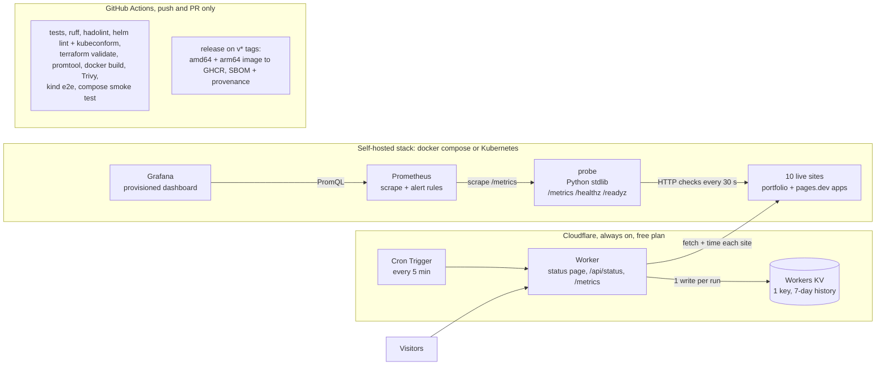

# FleetWatch

[](https://github.com/naniiic137/fleetwatch/actions/workflows/ci.yml)
[](https://github.com/naniiic137/fleetwatch/actions/workflows/release.yml)

**Uptime, latency and TLS-expiry monitoring for my live sites, built end to end:**
a dependency-free Python probe with hand-written Prometheus metrics, a Docker
Compose stack with Prometheus alerts and a Grafana dashboard, a hardened Helm
chart, a Terraform module, a CI pipeline that spins up a real Kubernetes cluster,
and an always-on Cloudflare Worker that serves the public status page.

**Live status page:** _coming soon (Cloudflare Worker URL goes here)_

## Architecture



## What each part shows

| Part | Where | What it demonstrates |
| --- | --- | --- |
| **Probe** | [`probe/`](probe) | Python 3.11+ **stdlib only**: HTTP(S) checks with status, latency, TLS days-to-expiry (via `ssl`) and keyword checks; a hand-written Prometheus exposition (HELP/TYPE, histogram buckets, gauges, counters); `/healthz`, `/readyz` (ready after the first round); JSON status on `/`; env-var config; structured JSON logs; graceful SIGTERM shutdown. 46 unit tests against local fake HTTP/HTTPS servers, no real network. |
| **Container** | [`Dockerfile`](Dockerfile) | Multi-stage build (unit tests run in the build stage), `python:3.12-slim`, numeric non-root user `10001`, `HEALTHCHECK` without curl. |
| **Local stack** | [`docker-compose.yml`](docker-compose.yml), [`deploy/prometheus`](deploy/prometheus), [`deploy/grafana`](deploy/grafana) | Probe + Prometheus (scrape config + alert rules) + Grafana (provisioned datasource + dashboard: uptime %, latency p50/p95, cert days left, up/down timeline). |
| **Kubernetes** | [`deploy/helm/fleetwatch`](deploy/helm/fleetwatch) | Deployment, Service, ConfigMap of targets, liveness/readiness probes, `runAsNonRoot` + `readOnlyRootFilesystem` + drop ALL capabilities + seccomp, resources, NetworkPolicy (ingress 8080, egress DNS + 80/443 only), optional ServiceMonitor, `values.schema.json` that rejects insecure overrides. |
| **IaC** | [`deploy/terraform`](deploy/terraform) | Terraform module deploying the chart with the `helm` provider, typed + validated variables and useful outputs. |
| **CI/CD** | [`.github/workflows`](.github/workflows) | Lint, test, build, scan, a real **kind** cluster e2e and a Compose smoke test on every push/PR; tagged releases push a multi-arch image with SBOM and provenance to GHCR. |
| **Edge status page** | [`worker/`](worker) | Cloudflare Worker in plain JS (no npm deps): Cron Trigger every 5 min, rolling 7-day history in **one** KV key, public status page (24 h / 7 d uptime, inline-SVG latency sparkline, dark/light, phone friendly), `/api/status` and `/metrics`. Pure functions tested with `node --test`. |

## Run it

### Probe on its own (Python 3.11+, nothing to install)

```bash
cd probe
FW_TARGETS_FILE=../targets.yaml FW_PORT=8080 python -m fleetwatch_probe
curl localhost:8080/metrics
python -m unittest discover -s tests -t .     # the test suite
```

### Docker Compose: probe + Prometheus + Grafana

```bash
docker compose up -d --build
```

| URL | What |
| --- | --- |
| http://localhost:8080/ | probe JSON status (`/metrics`, `/healthz`, `/readyz`) |
| http://localhost:9090/alerts | Prometheus with the FleetWatch alert rules |
| http://localhost:3000/ | Grafana "FleetWatch" dashboard (anonymous read-only) |

Edit [`targets.yaml`](targets.yaml) to change the sites, then `docker compose restart probe`.

### Kubernetes with kind + Helm

```bash
kind create cluster --name fleetwatch
docker build -t fleetwatch-probe:dev .
kind load docker-image fleetwatch-probe:dev --name fleetwatch
helm install fleetwatch deploy/helm/fleetwatch \
  --namespace fleetwatch --create-namespace \
  --set image.repository=fleetwatch-probe --set image.tag=dev --set image.pullPolicy=Never \
  --wait
kubectl -n fleetwatch port-forward svc/fleetwatch 8080:8080
curl localhost:8080/metrics
```

With a released image, skip the build/load steps and drop the `--set image.*` flags
(the chart defaults to `ghcr.io/naniiic137/fleetwatch:<appVersion>`).
Set `serviceMonitor.enabled=true` if the cluster runs the Prometheus Operator.

### Terraform

```bash
cd deploy/terraform
terraform init
terraform apply -var kube_context=kind-fleetwatch \
  -var image_repository=fleetwatch-probe -var image_tag=dev -var image_pull_policy=Never
```

Outputs: release name, namespace, status, chart version, service name, the
in-cluster metrics URL and a ready-to-paste `kubectl port-forward` command.

### Cloudflare Worker

Deployed from this repo by Cloudflare's Git integration: see
[`docs/DEPLOY-CLOUDFLARE.md`](docs/DEPLOY-CLOUDFLARE.md). Tests: `cd worker && node --test`.

## Probe reference

| Env var | Default | Meaning |
| --- | --- | --- |
| `FW_TARGETS_FILE` | `targets.yaml` (`/etc/fleetwatch/targets.yaml` in the image) | targets file |
| `FW_LISTEN_HOST` / `FW_PORT` | `0.0.0.0` / `8080` | HTTP listener |
| `FW_INTERVAL_SECONDS` | `30` | seconds between probe rounds |
| `FW_TIMEOUT_SECONDS` | `10` | per-check timeout |
| `FW_CONCURRENCY` | `8` | parallel checks |
| `FW_MAX_BODY_BYTES` | `1048576` | body bytes read for the keyword check |
| `FW_LOG_LEVEL` | `INFO` | `DEBUG`, `INFO`, `WARNING`, `ERROR` |

| Metric | Type | Labels |
| --- | --- | --- |
| `fleetwatch_probe_up` | gauge | `target`, `url` |
| `fleetwatch_probe_duration_seconds` | histogram (0.05 … 10 s) | `target` |
| `fleetwatch_probe_tls_cert_expiry_days` | gauge | `target` |
| `fleetwatch_probe_http_status_code` | gauge | `target` |
| `fleetwatch_probe_checks_total` | counter | `target`, `result` |
| `fleetwatch_probe_check_failures_total` | counter | `target`, `reason` (status, keyword, timeout, dns, connection, tls, protocol) |
| `fleetwatch_probe_last_check_timestamp_seconds` | gauge | `target` |
| `fleetwatch_probe_rounds_total`, `fleetwatch_probe_round_duration_seconds`, `fleetwatch_probe_targets`, `fleetwatch_probe_build_info` | counter / gauges | |

## Alert rules

Defined in [`deploy/prometheus/alerts.yml`](deploy/prometheus/alerts.yml), checked by `promtool` in CI.

| Alert | Expression | For | Severity |
| --- | --- | --- | --- |
| `FleetWatchTargetDown` | `fleetwatch_probe_up == 0` | 2m | critical |
| `FleetWatchHighLatency` | `histogram_quantile(0.95, sum by (target, le) (rate(fleetwatch_probe_duration_seconds_bucket[5m]))) > 2` | 10m | warning |
| `FleetWatchCertExpiringSoon` | `fleetwatch_probe_tls_cert_expiry_days < 14` | 15m | warning |

## CI

| Job | Checks |
| --- | --- |
| Probe unit tests | `python -m unittest` (fake HTTP/HTTPS servers, SIGTERM shutdown test) |
| Lint Python | `ruff check` (installed in CI only) |
| Lint Dockerfile | hadolint |
| Helm | `helm lint --strict`, `helm template` piped into `kubeconform -strict` (incl. the ServiceMonitor CRD schema), schema rejects insecure values |
| Terraform | `terraform fmt -check`, `terraform validate` |
| Prometheus | `promtool check config` and `promtool check rules` |
| Worker | `node --test` |
| Docker | image build, non-root + healthcheck check, Trivy scan (report only, shown in the job summary) |
| E2E on kind | builds the image, loads it into a kind cluster, `helm install --wait`, port-forward, asserts `/healthz`, `/readyz` and the metric families on `/metrics` |
| Compose smoke test | `docker compose up`, waits until Prometheus reports `up{job="fleetwatch-probe"} == 1`, checks the alert rules and the Grafana dashboard |

`release.yml` runs only on `v*` tags: QEMU + buildx build `linux/amd64` and
`linux/arm64`, push to `ghcr.io/naniiic137/fleetwatch` with `sbom: true` and
`provenance: mode=max`, using `GITHUB_TOKEN` with `packages: write`.

## Design decisions

**Why the probe uses only the standard library.** The image stays tiny with no
dependency CVEs to patch, there is no supply chain to pin, and writing the
exposition format by hand shows I know what Prometheus actually parses: HELP/TYPE
lines, label escaping, cumulative `le` buckets ending in `+Inf`, `_sum`/`_count`,
`_total` counters. The tests check the output line by line against the format.
`targets.yaml` uses a small documented YAML subset that the probe parses itself.

**Why the Worker writes one KV key per run.** The Workers KV free plan allows
**1,000 writes per day** (and 100,000 reads). The math:

| Approach | Writes/day | Fits the free plan? |
| --- | --- | --- |
| one key per site per run, every 5 min | 10 × 288 = **2,880** | no |
| one key per run, every 1 min | 1,440 | no |
| **one key per run, every 5 min (FleetWatch)** | **288** (29% of the quota) | yes, with 712 writes/day to spare |

The single `state` value holds, per site, every check of the last 24 h (288
points, for the sparkline and 24 h uptime) plus one bucket per hour for 7 days
(168 buckets, for 7-day uptime). That is about 85 KB for 10 sites, far below the
25 MiB value limit, and reading it is one KV read per page view. Adding sites
does not add writes. The Worker reads only the status code and cancels the
body, which keeps each run inside the free plan's 10 ms CPU limit.

**Why there is no cron in GitHub Actions (and no Dependabot).** Scheduled
workflows and bot PRs generate notifications whether or not anything is wrong.
CI runs only on push, pull request and manual dispatch; the always-on checking
lives on Cloudflare's scheduler, which has no notification side effects and
costs nothing.

**Why redirects are not followed.** A site that suddenly redirects
(for example to a parking page) should look different from a healthy one, so
`expect_status` is compared to the first response.

## Repository layout

```text
probe/                  Python probe (fleetwatch_probe/) and its tests
Dockerfile              multi-stage image for the probe
docker-compose.yml      probe + Prometheus + Grafana
targets.yaml            the sites to watch (shared by probe, chart and Worker)
deploy/prometheus/      scrape config + alert rules
deploy/grafana/         datasource + dashboard provisioning
deploy/helm/fleetwatch/ Helm chart
deploy/terraform/       Terraform module (helm provider)
worker/                 Cloudflare Worker (status page, cron, KV)
docs/                   Cloudflare deploy guide
.github/workflows/      ci.yml, release.yml
```

## Licence

Copyright (c) 2026 Hamza Ben Ismail. **All rights reserved.** See [LICENSE](LICENSE).
